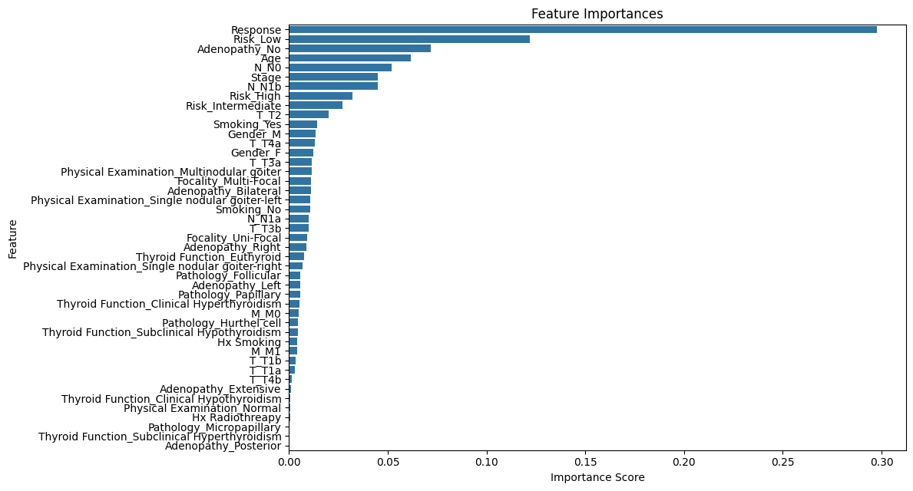

# Comparative Analysis of Tree-based Optimization Techniques for Thyroid Cancer Recurrence Prediction

## Abstract
I evaluate three tree-based machine learning optimization techniques—Evolutionary Algorithm (EA) with Decision Trees, Grid Search with Random Forests, and Tree-based Genetic Programming (TGP) with DEAP—for predicting recurrence in differentiated thyroid cancer patients. Using a dataset of 383 samples with 17 features from Kaggle, I preprocess the data with standard scaling, one-hot encoding, and label encoding. The EA-optimized Decision Tree achieves 97.4% test accuracy and 91.5% cross-validation accuracy, while the Grid Search-optimized Random Forest scores 97.4% test and 95.1% cross-validation accuracy. The TGP model, leveraging DEAP, attains 97.4% accuracy on both train and test sets. Feature importance analysis identifies "Response" as a dominant predictor across all models. My results suggest Random Forest offers superior generalization, while TGP provides robustness. I recommend exploring hybrid approaches combining EA and TGP for future research to balance complexity and performance.

## 1. Introduction
Predicting recurrence in differentiated thyroid cancer is vital for effective patient management and treatment planning. Tree-based machine learning models, including Decision Trees and their extensions, provide interpretable and powerful tools for such clinical predictions. In this study, I compare three optimization strategies: (1) Evolutionary Algorithm (EA) optimization of a Decision Tree, (2) Grid Search optimization of a Random Forest, and (3) Tree-based Genetic Programming (TGP) using the DEAP library. My objective is to assess their performance on a thyroid cancer recurrence dataset and offer insights for future applications in medical machine learning.

## 2. Dataset
The dataset, sourced from Kaggle [1], contains 383 patient records with 17 features, including demographic factors (e.g., age, gender), clinical history (e.g., smoking, radiotherapy), and tumor characteristics (e.g., stage, response). The binary target variable, "Recurred," indicates recurrence (Yes/No). I found no missing values, ensuring a robust foundation for my analysis.

## 3. Methodology
### 3.1 Decision Tree with Evolutionary Algorithm (EA)
I optimized a Decision Tree Classifier from scikit-learn [5] using `scipy.optimize.differential_evolution` [2]. I tuned parameters (`max_depth`: 1-17, `min_samples_split`: 2-50, `min_samples_leaf`: 1-50) over 10 iterations with a population size of 10. Preprocessing involved StandardScaler for numerical features (e.g., Age), OneHotEncoder for nominal features (e.g., Gender), and LabelEncoder for ordinal features (e.g., Stage).

### 3.2 Random Forest with Grid Search
I optimized a Random Forest Classifier, an ensemble of Decision Trees from scikit-learn [5], using `GridSearchCV` [3]. The parameter grid included `max_depth` (1-17 + None), `min_samples_split` (2-14), and `min_samples_leaf` (1-14), evaluated with 5-fold cross-validation. Preprocessing mirrored the EA approach.

### 3.3 Tree-based Genetic Programming (TGP) with DEAP
I implemented TGP using the DEAP library [4]. The primitive set incorporated arithmetic (e.g., add, subtract, multiply, divide), trigonometric (e.g., sin, cos), and conditional (e.g., if_neg, if_pos, if_zero) operators. I evolved the model over 150 generations with a population of 700 individuals, optimizing Binary Cross-Entropy (BCE) loss, constrained to a maximum tree depth of 7. Preprocessing was consistent with prior methods.

## 4. Results
### 4.1 Decision Tree with EA
I achieved a test accuracy of 97.4% with the EA-optimized Decision Tree, indicating strong predictive performance on the held-out test set. However, the 5-fold cross-validation accuracy was lower at 91.5%, suggesting some overfitting to the training data. Feature importance analysis highlighted "Response" (0.891) as the dominant predictor, followed by "Risk_Low" (0.063) and "Age" (0.040).

  
*Confusion Matrix showing true positives and negatives for the Decision Tree model.*

  
*Feature Importance plot illustrating the key predictors in the EA-optimized model.*

### 4.2 Random Forest with Grid Search
The Random Forest model, optimized via Grid Search, also reached a test accuracy of 97.4%, matching the Decision Tree’s performance. Notably, its 5-fold cross-validation accuracy of 95.1% was higher, reflecting better generalization across unseen data splits. Key features included "Response" (0.298), "Risk_Low" (0.122), and "Adenopathy_No" (0.072), showing a more distributed importance compared to the Decision Tree.

  
*Confusion Matrix depicting classification performance of the Random Forest model.*

  
*Feature Importance plot highlighting influential features in the Random Forest.*

### 4.3 Tree-based Genetic Programming with DEAP
With TGP, I obtained a train accuracy of 97.4% and a matching test accuracy of 97.4%, with BCE values of 0.070 (train) and 0.101 (test), indicating robustness and minimal overfitting. Perturbation-based feature importance identified "Response" (0.895) as overwhelmingly influential, followed by "Thyroid_Function_Euthyroid" (0.018) and "Stage" (0.017). The symbolic tree structure provided a unique perspective on feature interactions.

  
*Confusion Matrix illustrating TGP’s classification results on the test set.*

  
*Perturbation-based Feature Importance showing the impact of features on TGP predictions.*

  
*Graph of the best evolved individual in the TGP model, showcasing its symbolic structure.*

## 5. Discussion
The consistent 97.4% test accuracy across all models underscores the dataset’s predictive power, particularly driven by "Response." The Random Forest’s higher cross-validation score reflects its ensemble nature, mitigating overfitting compared to the single Decision Tree optimized by EA. TGP’s symbolic approach, while computationally intensive, effectively captures complex relationships, as evidenced by its low BCE and consistent train-test performance. However, due to the computational complexity of evolving a population for each fold, I did not perform cross-validation for TGP. Instead, I evaluated its best individual on a separate test set, achieving 97.4% accuracy, suggesting robustness despite the lack of CV. EA’s lower generalization may stem from its limited parameter search scope compared to Grid Search or TGP’s evolutionary flexibility.

## 6. Recommendations
For future research, I propose:
1. Hybridizing EA and TGP to combine parameter optimization with symbolic flexibility, potentially enhancing performance.
2. Exploring scalable TGP implementations (e.g., reduced generations or population size) to enable cross-validation.
3. Applying these techniques to larger datasets to assess scalability and robustness.

For practitioners, I suggest Random Forest as it offers a practical balance of accuracy, generalization, and interpretability for clinical deployment.

## 7. Conclusion
This study demonstrates that my EA-optimized Decision Tree, Grid Search-optimized Random Forest, and TGP with DEAP effectively predict thyroid cancer recurrence. The Random Forest excels in generalization (95.1% CV), while TGP offers robustness (97.4% train/test). These findings highlight the strengths of tree-based optimization strategies in medical machine learning, paving the way for tailored approaches in clinical prediction tasks.

## 8. References
[1] Joe Beach, "Differentiated Thyroid Cancer Recurrence Dataset," Kaggle, 2023. [Online]. Available: https://www.kaggle.com/datasets/joebeachcapital/differentiated-thyroid-cancer-recurrence  
[2] SciPy Community, "scipy.optimize.differential_evolution," SciPy v1.11.0 Manual, 2023.  
[3] Scikit-learn Developers, "sklearn.model_selection.GridSearchCV," scikit-learn v1.3.0 Documentation, 2023.  
[4] F.-A. Fortin et al., "DEAP: Evolutionary Algorithms Made Easy," Journal of Machine Learning Research, vol. 13, pp. 2171-2175, 2012.  
[5] Scikit-learn Developers, "scikit-learn: Machine Learning in Python," 2023. [Online]. Available: https://scikit-learn.org  